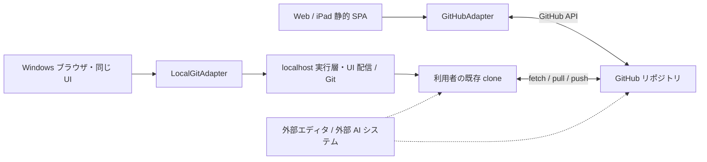

# syuire(朱入れ)設計案

syuire は、GitHub を共有の正本とする Markdown 朱入れクライアント。
Web と Windows ローカルで原稿を読み、本文の箇所に紐づくコメント・返信・解決状態を Markdown 内に保存する。
AI による本文修正や自動実行は別システムで行う。

状態: 設計案 v0.5 (2026-09-07)。実装未着手。

## 1. 設計の判断

1. **原稿・朱・履歴は Git リポジトリに置く。** GitHub は共有の正本、ローカル clone は未 push のコミットも含む作業用リポジトリ。両者が常時一致するとは扱わない。
2. **保存は commit、共有は push。** Web は GitHub 上へのコミットで両方が完了する。ローカルは commit 成功と push 成功を別々に表示する。ファイルを書いただけでは保存成功にしない。
3. **サービス側に利用者のリポジトリ情報を持たない。** 公開サービスは静的アセットの配信だけ。リポジトリ登録 DB、中継 API、原稿キャッシュ、同期台帳を作らない。
4. **端末内の復旧用一時データと非秘密の設定は許容する。** 未保存の朱まで失いやすくする必要はない。復旧に必要な最小限をセッション内に保持し、保存後に削除する。
   接続先・ブランチ・パスのような非秘密情報は端末内に残してよい。禁止するのは秘密情報の永続化と、サービス側への蓄積である。
5. **確実なものだけ自動で再適用する。** 場所や意図が曖昧な競合は停止して人が確認する。誤った箇所に朱を付けて成功扱いしない。
6. **AI との境界はファイル形式。** CLI/MCP を先に作ることは目的にしない。特定 AI の起動、監視、プロンプト、Actions は本体の責務に含めない。

「DB なし」は、Git が保持する情報を別のアプリ DB に複製しないという意味である。
ローカル clone の `.git` や、端末内の短期的な復旧データまで禁止する意味ではない。

## 2. 要件と対象範囲

| 要件 | 方針 |
|------|------|
| 本文の箇所への朱入れ | Markdown 内の構造化 HTML コメントと引用アンカー |
| コメント・返信・解決の履歴 | Git コミット履歴。公開時はリポジトリ内に退避ログ |
| Web / iPad で利用 | 静的 SPA から GitHub API に直接アクセス |
| Windows ローカルで利用 | 同じ UI をローカル実行層から配信し、既存 clone と Git を操作 |
| 保存の確定 | 1 回の保存操作を 1 コミットにする |
| 外部編集との共存 | 再読込、版の検証、競合の停止と再指定 |
| サービスへの情報蓄積を避ける | 利用者アカウント・リポジトリ登録・サーバー保存なし |

v1 の対象外: 本文編集 UI、リアルタイム共同編集、Web のオフライン編集、Git の汎用競合解消 UI、
PR 作成・マージ、AI 実行、汎用 CLI、MCP サーバー。
既存の GitHub リポジトリと作業ブランチを使用し、clone 作成やブランチ作成は外部の Git ツールで行う。

## 3. 全体構成



- Web は GitHub Pages 等で静的配信する。原稿を配信サービス経由で取得しない。
- ローカルは `syuire serve <cloneのパス>` 相当のランチャーを起動し、localhost の UI を開く。
  これは UI の起動手段であり、コメント操作用の汎用 CLI ではない。
- File System Access API だけでは Git 操作を担当できないため、LocalFolderAdapter 案は採用しない。
- ローカル実行層は利用者の PC 上だけで動き、DB・独自 clone・リポジトリ登録一覧を持たない。
  起動時に指定した clone だけを、その実行中に操作する。
- AI と同じ clone を使うことはできるが、同じ作業ツリーへの同時書込みは v1 ではサポートしない。
  自動編集を並行稼働させる場合は、利用者が別 clone を用意し GitHub 経由で受け渡す。

## 4. 保存と同期

### 4.1 共通の操作

- 「朱を追加」: コメント入力を未保存キューに積む。この時点では保存済みと表示しない。
- 「保存」: キューを 1 コミットにまとめる。確定した操作は再送対象から外す。ローカル反映が未完了なら復旧情報を保持する。
- 「最新」: Web は選択ブランチを再取得。ローカルは fetch と、条件を満たす場合の fast-forward pull。
- ローカルの「GitHub に反映」: 選択ブランチを通常の push で送る。
- ローカルには「保存して GitHub に反映」も設ける。commit 後に push が失敗した場合は、
  **ローカル保存済み・GitHub 未反映**と表示し、同じコメントをもう一度 commit しない。

コミット確定の根拠は対象 ref への反映とコミット ID。ローカル保存完了には、対象パスの HEAD・通常 index・作業ツリーの一致も必要。
共有成功の根拠はそのコミットがリモートブランチに含まれること。コミット確定後の部分失敗は 7.2 節の「コミット済み・ローカル反映要復旧」と表示する。
未保存キュー、ローカル未 push コミット、リモートの未取得コミットを別々に扱う。

### 4.2 ローカルとリモートの差

差は独自の同期 DB に保存せず、ローカル HEAD と fetch 後の remote-tracking ref から都度求める。
ネットワーク未確認時は「最終確認時点」と表示し、現在も同期済みとは断定しない。

| 状態 | 動作 |
|------|------|
| ローカルとリモートが一致 | 通常どおり保存・push 可能 |
| リモートのみ先行 | fast-forward pull。pull が上書きするファイルに未コミット変更があれば Git の拒否に従って停止。キューがあれば更新後に再適用 |
| ローカルのみ先行 | 通常の push。他の未 push コミットも送られることを対象一覧で表示 |
| 双方が先行して分岐 | 自動 merge/rebase せず停止。通常の Git ツールで統合して再読込 |
| 通信不可 | ローカル commit は可能。リモート状態は不明、push は未完了 |
| upstream 未設定・不一致 | commit は可能。push と同期状態表示は無効。外部 Git ツールで upstream を設定する |
| detached HEAD / merge 等の途中 | 読取のみ。外部 Git ツールで状態を整える |

保存結果未確認・ローカル反映要復旧の間は、この表より 7.2 節の操作制限を優先する。

force push、自動 stash、履歴の自動書換え、利用者の変更を破棄する reset は行わない。
保存前には可能なら fetch するが、commit と push の間の競合は常に起こり得る。
pull は fast-forward のみを許可する。[Git pull 仕様](https://git-scm.com/docs/git-pull)

## 5. コメント形式

### 5.1 基本形式

Markdown の HTML コメントに JSON を埋め込む。形式にはバージョンを持たせ、本リポジトリで仕様を管理する。
md-redline の形式を参考にするが、完全互換や外部ツールによる追加フィールド保持は保証しない。
互換対応は対象バージョンを固定した往復テストができた範囲だけで宣言する。

```markdown
本文の <!-- @comment{"schemaVersion":1,"id":"a3407a0e-86b6-4b0d-968b-1c734d723a55","anchor":"この表現","prefix":"本文の ","suffix":"を見直す。","text":"具体例を加えてほしい","author":"naoki","timestamp":"2026-09-07T09:12:00+09:00","state":"open","replies":[]} -->この表現を見直す。
```

| フィールド | 意味 |
|------------|------|
| `schemaVersion` | 形式のバージョン |
| `id` | UUID。コメント追加操作の識別子も兼ねる |
| `anchor` | 選択された表示文字列。作成時の引用として保持 |
| `prefix` / `suffix` | 作成時の前後の表示文字列。各最大 32 Unicode コードポイント |
| `text` | コメント本文 |
| `author` | 表示用識別子。Web は GitHub の `/user` から得た login を既定値とし、利用者が変更できる。ローカルは Git の `user.name` を既定値にする。認証済みの本人証明とは扱わない |
| `timestamp` | オフセット付き ISO 8601 |
| `state` | `open` / `resolved` |
| `replies` | `{id, author, timestamp, text}` の配列。返信 ID も UUID |

全フィールドを必須とし、文書境界の prefix/suffix は空文字を許容する。
`anchor` / `prefix` / `suffix` は、すべてのマーカーを除いた表示文字列から計算する。同じ段落に別のマーカーがあっても、その JSON が前後文脈に混入しない。
コメント位置はマーカーの物理位置を基本とし、引用と前後文脈を再配置の補助に使う。
外部修正で引用が変わった場合は元の引用を残し、「対象変更あり」と表示する。
本文全体から似た文を探して既存コメントを勝手に移動しない。必要なら利用者が対象を再指定して保存する。

### 5.2 挿入位置とパース

- 通常の本文では、構文を壊さない場合に選択位置の直前へ挿入する。マーカーの前後に空白を足さない。
- 選択位置が行頭のときはインライン挿入せず、所属ブロックの直前へ置く。
  行頭で始まる `<!--` は CommonMark の HTML ブロック(type 2)になり、同じ行の残りを本文から切り離すためである。
- 見出し・表・コードブロック・インライン記法の途中など、安全に挿入できない場合は所属ブロックの直前へ置く。
  空行を含め、Markdown の構造が変わらない配置にする。
- ブロック直前に置くマーカー行は、所属するコンテナブロック(リスト項目・引用・その入れ子)のインデントと `> ` プレフィックスを継承する。
  列 0 に置くとコンテナが分断され、番号付きリストの番号が振り直されたり引用が二つに割れたりする。
- ブロック全体にしか対応付けられない場合は「段落への朱」「表への朱」等を明示する。
  複数段落・複数ブロックの選択は v1 では受け付けず、範囲の選び直しを案内する。黙って切り詰めない。
- フロントマターは対象外。コード内のマーカーに似た文字列は通常のコードとして扱う。
- JSON 文字列内の `<`、`>`、`&` を Unicode エスケープし、`-->` 等で HTML コメントが終了しないようにする。
  JSON シリアライズ後の JSON テキスト全体で、連続ハイフンの 2 文字目以降を JSON ソース上のリテラル `\u002d` に置き換え、連続する `--` を避ける。
  妥当な JSON では文字列の外に `--` は現れないため、文字列値だけでなく未知フィールドのキー名も同じ規則で扱える。
  例: `--` → `-\u002d`、`---` → `-\u002d\u002d`。JSON.parse 後は元の値に戻す。
  元から文字列として含まれる `\u002d` はシリアライズ時にバックスラッシュがエスケープされるため壊れない。
- 未知の追加フィールドは保持する。未知バージョン、重複 ID、壊れたマーカーを検出したファイルは読取表示に留め、保存・刷り出しを停止する。
- マーカー以外の Markdown は再整形しない。改行形式・BOM・空白を維持し、局所的な差分だけを作る。

### 5.3 ライフサイクル

人が追加 → open → 返信・本文の確認 → 人が resolved → 必要なら再オープン。
外部システムが付けた返信・状態も表示するが、本体は AI による解決判断や実行許可を管理しない。
通常操作ではマーカーを削除しない。除去は次の「刷り出し」に限定する。
外部ツールが削除・破損した場合は Git 差分から確認できるようにし、本体が未観測の編集まで防げるとはしない。

### 5.4 刷り出し

公開用にマーカーを除去し、履歴を同じリポジトリ内の Markdown に退避する UI を設ける。

1. 未保存操作がなく、全コメントが resolved で、形式エラーや対象未確認がないことを確認する。
2. 除去後の本文と退避ログの差分を表示する。
3. 本文更新とログ新規作成を **1 コミット**にまとめる。

退避先は `reviews/<元の相対パスから拡張子 .md を除いたもの>/<UTC日時>-<batchId>.md`。
例: `docs/foo.md` → `reviews/docs/foo/20260907T001200Z-<UUID>.md`。既存パスには上書きしない。
`foo.md` のような拡張子付きディレクトリ名は静的サイト生成ツール等が誤認しやすいため使わない。
`reviews/` は v1 では固定とし、配信・生成ツールの対象から外す設定は利用者側のリポジトリで行う。
ログには元パス・変更前のコミット ID・batchId・全マーカーの JSON と読みやすい一覧を残す。
open が残っている状態で全削除する機能は v1 に設けない。

## 6. UI と原稿の描画

- TypeScript + Vite。Web / ローカルで UI と core を共有する。
- Markdown は remark / remark-gfm → rehype で描画し、テキストノードとソース範囲の対応を描画時に生成する。
  mdast の position はノード単位なので、バックスラッシュエスケープや文字参照を含むテキストノードではノード内オフセットとソースオフセットがずれる。
  対応表は micromark のトークン列(`data`、`characterEscape`、`characterReference` 等)から文字単位で作る。ノードの position から文字数で補間しない。
- DOM Selection は Range の開始・終了に正規化し、逆方向選択にも対応する。
  `**` やリンク記法を文字数だけで読み飛ばす逆引きは採用しない。
- 太字、リンク、インラインコード、文字参照、エスケープ、改行、日本語と絵文字を検証対象とする。
  正確な対応が取れない場合はブロックへの朱として利用者に提示する。
- iPad の選択メニューと衝突しないよう、画面下の固定ボタンでコメント入力を開く。
  シートにフォーカスを移す前に選択範囲を保持する。
- 既存の朱は縦線と番号で表示し、タップで引用・返信・状態を確認する。
- ヘッダにはリポジトリ、ブランチ、ファイル、未保存件数、保存先、同期状態を表示する。
- 原稿の raw HTML は実行しない。コメントは文字列として表示し、リンクのスキームも制限する。
  外部画像は既定で自動取得せず、リポジトリ内画像は選択した版から取得する。
- PWA は後続の利便性改善。導入してもキャッシュ対象はアプリの静的アセットだけにする。

## 7. RepositoryAdapter

UI からは「ファイルを書いたか」ではなく「コミットが確定したか」を扱う。
接続先とブランチはアダプタのセッションに固定し、切替時には未保存操作を別の対象へ持ち越さない。

```ts
type Entry = { path: string; kind: "file" | "dir"; blobId?: string; size?: number };
type Snapshot = {
  revision: string; // 読み取ったコミット ID
  files: Record<string, { text: string; blobId: string } | null>;
};
type Change = { path: string; text: string }; // 更新または新規作成
type CommitResult =
  | { status: "committed"; commitId: string; localReflection: "complete" | "not-applicable" }
  | { status: "committed"; commitId: string; localReflection: "needs-recovery"; paths: string[]; reason: string }
  | { status: "unknown"; batchId: string; candidateCommitId?: string };
interface RepositoryAdapter {
  list(dir: string, revision: string): Promise<Entry[]>;
  read(paths: string[], revision?: string): Promise<Snapshot>;
  commit(input: {
    base: Snapshot;
    changes: Change[];
    batchId: string;
    message: string;
  }): Promise<CommitResult>;
}
```

型は概念を示すもの。エラーは競合、認証・権限、作業ツリー要復旧を区別する。
通信結果不明とコミット確定後のローカル反映失敗はエラーではなく CommitResult で返す。
Web の localReflection は not-applicable。ref 更新前の確実な競合・認証エラー等はエラーとして返し、
ref 更新結果が不明なら unknown、確定後のローカル反映失敗なら committed / needs-recovery とする。
fetch / pull / push / 同期状態取得は LocalGitAdapter の追加能力とし、Web に擬似的なローカル clone を作らない。
書込対象は選択リポジトリ内の Markdown と退避ログに限定する。`.git`、シンボリックリンクによる範囲外アクセスを拒否する。

### 7.1 GitHubAdapter

読取りはブランチ先端のコミット ID を確定し、その版を指定して一覧・本文を取得する。
通常は Contents API の JSON から base64 本文と blob SHA を取得する。
raw レスポンスを使う場合は同じコミットのメタデータから SHA を別途取得し、ETag を blob SHA の代用にしない。
v1 の編集対象は 1 ファイル 1 MiB 以下とし、それを超えるファイルは理由を表示して編集対象外にする。
[GitHub Contents API 仕様](https://docs.github.com/en/rest/repos/contents#get-repository-content)

書込みは単一ファイルも刷り出しも Git Data API に統一する。
変更 blob → 読取時の tree を基にした tree → 読取時の commit を唯一の親とする commit → 対象 ref の非 force 更新、の順に行う。
無関係な tree エントリとファイルモードを保持する。
ref 更新の直前に対象 ref の現在値を取得し、`base.revision` と一致しなければ更新せず再取得する。
通常の先行コミットとの競合で ref 更新が拒否されたら再取得する。
非 force 更新は fast-forward 保護であり、任意の force push・ブランチ巻戻しまで含む厳密な版比較ではない。
作業ブランチの履歴書換えは運用対象外とし、検出した場合は停止する。
[GitHub ref 更新仕様](https://docs.github.com/en/rest/git/refs#update-a-reference)

ref 更新前の失敗では、ブランチ上に片方のファイルだけが公開されることはない。
認証・保護ルール・レート制限・検証エラーをすべて競合として再試行しない。
書込みが拒否された場合は未保存キューを保持して理由を表示する。

### 7.2 LocalGitAdapter

- 利用者が指定した既存 clone と、既存の Git 認証・author 設定を使用する。
- 保存は通常の Git porcelain を使う。対象ファイルを作業ツリーへ反映し、`git commit --only -- <対象パス...>` で 1 コミットにする。
  `--only` により対象パスの作業ツリー内容だけをコミットし、無関係な staged 変更をコミットへ混入させない。
  未追跡の退避ログは、対象パスとして認識させるため `git add -N -- <ログパス>` を先に行う。
  ログパスが `.gitignore` に該当して `add -N` が拒否された場合は、理由を表示して停止する。
  commit 成功後は対象パスの HEAD・通常 index・作業ツリーが揃い、無関係な通常 index と作業ツリーは保持される。
- clean 条件は対象パスに限定する。対象パスの作業ツリー内容が HEAD の blob と一致し、通常 index に対象パスの staged 変更・未解決エントリがないこと。
  無関係なファイルの未コミット変更や未追跡ファイルは保存を妨げず、commit にも含めない。出力先(退避ログ)に既存ファイルがあれば拒否する。
- 保存対象となる全文をメモリ上で準備し、対象ごとの変更前後の指紋を保持してからファイルへ反映する。
  複数ファイルの作業ツリー反映は原子的ではないため、途中失敗は「準備済み・未コミット」として扱い、commit を実行しない。
- 内容の照合は `git hash-object --path` で `.gitattributes` と `core.autocrlf` を通した後の blob ID で行う。
  mode も照合する。作業ツリーの CRLF と blob の LF を生バイトで比較しない。mtime だけで版を判断しない。
  書込み直前の外部編集検知には生バイトの指紋も使い、改行だけの外部変更も無断で上書きしない。
- ファイル反映後、commit の直前にブランチ・HEAD・対象パスの指紋を再確認する。想定外の値なら commit せず停止する。
- commit 後に、作成コミットの親が基準 HEAD であること、対象 tree の blob / mode が準備内容と一致すること、
  対象パスの通常 index・作業ツリーが新しい HEAD と一致することを検証してローカル保存完了とする。
- `git commit` の hooks と署名設定には通常どおり従う。`--no-verify` や `--no-gpg-sign` で回避しない。
  hook・署名・index lock 等による失敗ではコミット未成立としてキューを保持し、作業ツリーに残る準備済み変更を表示する。
- 実行層内ではリポジトリ単位に操作を直列化し、準備した差分だけを書き込む。
- 外部エディタはアプリのロックに従うとは限らない。検査と書込みの間の競合を完全に防げるとはしない。
  書込み中の外部編集を検出したら停止し、コミット確定の有無に応じて下記の状態を表示する。保存完了表示や push は行わない。
  Windows ではエディタのファイルロックで作業ツリーへの書換えや rename が失敗し得る。同様に要復旧として表示する。
- Git は `GIT_TERMINAL_PROMPT=0`、SSH は `BatchMode=yes` で起動し、対話プロンプト待ちで固まらせず認証失敗として表示する。
- `git commit` が失敗した場合は未コミットとしてキューを維持する。再試行時は対象が操作前または準備後の既知の値かを照合し、
  準備後の値ならファイルを二重に変更せず commit だけを再試行する。想定外の値なら外部変更として停止する。
- commit の終了結果を受け取れない場合は保存結果未確認とし、履歴の batchId と親・変更パスを確認するまで再コミットしない。
- commit 成功後の検証で準備と異なる tree、対象パスの不整合、予期しない hook の変更を検出した場合は、
  コミット済み・ローカル反映要復旧として push を禁止する。確定コミットを自動で amend・reset・revert しない。
- 刷り出しも 1 コミットにする。Git 上の公開単位は一体で、片方だけの commit は起こらない。
  作業ツリーへの複数ファイル反映は原子的ではないため、途中失敗はローカル反映要復旧として扱う。

#### 部分失敗と状態

複数ファイルの作業ツリー反映と commit は単一トランザクションではない。
ファイル反映中の失敗、commit の明確な失敗、commit 成否不明、commit 後の検証失敗を区別する。

| 状態 | 判定 | キューと許可する操作 |
|------|------|----------------------|
| 未保存 | 作業ツリー反映前 | 操作キューを保持。通常どおり保存可 |
| 準備済み・未コミット | 対象の全部または一部が準備後の値、commit 未成立 | 操作キューと指紋を保持。既知の値だけなら再保存または明示的な取消可 |
| 保存結果未確認 | commit の成否が不明 | batchId / commitId を保持。履歴照合まで新規保存・pull・push 禁止 |
| コミット済み・ローカル反映要復旧 | ref 更新成立、対象の三者一致が未完了 | 操作を再コミットしない。復旧情報を保持。新規保存・pull・push 禁止 |
| ローカル保存済み | ref 更新成立、対象の三者一致を確認済み | 確定済み操作と復旧情報を除去。通常の同期操作可 |
| GitHub 反映済み | 確定コミットのリモート包含を確認済み | ローカル反映要復旧がなければ通常利用可 |

#### 復旧

- commit 未成立なら、操作前・準備後の指紋と現在値を比較する。既知の準備後の値は再利用し、部分反映なら不足分だけを準備して commit する。
  取消は差分を表示し、対象が準備後の値から変わっていない場合に利用者の明示操作で行う。
  `git add -N` で通常 index に残った退避ログの intent-to-add エントリは、取消時に `git reset -- <ログパス>` 相当で除去する。
- commit 成立後の復旧元は確定コミット。新しい commit を作らず、対象 ref と checkout ブランチが期待と一致することを再確認する。
- 対象ファイル・通常 index が操作前または操作後の既知の値なら、差分を表示し、利用者の明示操作で未完了箇所だけを反映する。
- それ以外の値なら外部変更の可能性があるため、上書きせず外部 Git ツールでの確認へ回す。
- 再起動後は Git の batchId・親コミット・変更パスと作業ツリー差分から確定状況を調べる。復旧情報を失った場合は、旧版と一致するだけで自動上書きしない。
  利用者が意図して旧版に戻した可能性を区別できないため、差分の確認を必要とする。
- 復旧情報はローカル反映完了まで保持し、未保存操作と区別する。独自の永続バックアップや同期 DB は追加しない。

ローカル実行層は loopback のみに bind し、同一 origin と起動ごとのセッショントークンを検証する。
汎用シェル実行 API を公開せず、引数を構造化して Git を起動する。
外部サイトからローカルファイルや Git を操作できない境界を持たせる。

### 7.3 操作キューと競合

キューは完成済み Markdown 全文ではなく、次の操作を保持する。

- `addComment`: コメント ID、引用、前後文脈、対象ブロック、元のソース範囲。
- `addReply`: コメント ID、返信 ID、本文。
- `setState`: コメント ID、変更前の状態・対象スレッドの指紋、確認した対象本文の指紋・対象を特定する情報、変更後の状態。
- `reanchor`: コメント ID、変更前の対象情報、新しい引用と位置。

各保存に batchId を付け、コミットメッセージの `syuire-Batch: <UUID>` に記録する。
コメント・返信 ID は再試行でも変えない。同一 ID が同内容なら適用済みとし、内容が異なれば競合とする。

保存前に最新の版を確認し、変わっていたら未保存操作だけを再適用する。
追加のアンカーは引用と前後文脈から一意に決まる場合だけ採用し、不一致・複数候補は再指定を求める。
返信は ID でスレッドへ追加する。状態変更は、確認後に返信等が増えた場合や、対象本文が変わった場合に再確認させる。
例えば「納期は10日」を見て resolve を選んだ後、外部から本文だけ「30日」に変更された場合は保存を止める。
本文の指紋は、所属ブロックから syuire マーカーを除いた Markdown ソースの改行を LF に正規化して計算する。
それ以外の空白・リンク先・記法は保持する。表示文字列だけの照合でリンク先の変更を見落とさないようにする。
対象を一意に対応付けられない場合も停止する。無関係な別ブロックの編集だけなら、一意に特定できる限り保存を許容する。
同じバッチ内の自分の返信等は、基準状態にキューを順番に適用した仮想状態で評価し、自己競合させない。
外部から同じ状態に変わっただけで適用済みとせず、まず batchId による同一操作の確定確認を行う。
この検査は状態変更を選んでから保存するまでの競合防止であり、保存後の外部本文変更による自動再オープンは行わない。
対象コメントが削除・退避されていた場合は復活させず停止する。
問題のある操作を含むバッチは丸ごと保留し、本文末尾へ勝手に移動して保存しない。

自動再試行は最大 2 回。それ以上は更新が続いていることを表示する。
応答が途切れた場合は、再保存の前に選択ブランチの履歴で batchId と作成した commit の包含を確認する。
結果を確認できない間は「保存結果未確認」とし、重複コミットを作らない。
ローカルは確定を確認した後も三者一致を検査し、未完了なら再コミットではなく 7.2 節の復旧へ進む。
刷り出しは基準版が変わったら差分プレビューからやり直す。

## 8. データの保管と認証

| データ | 場所と寿命 |
|--------|------------|
| 原稿・コメント・返信・解決状態・退避ログ | GitHub と利用者の clone。唯一の永続的な業務データ |
| 未 push コミット、remote-tracking ref | 既存 clone の `.git`。アプリ側に複製しない |
| 開いている本文・SHA・一覧・同期状態 | メモリのみ。必要時に再取得 |
| 未保存操作と保存結果確認中の batchId / commitId | メモリ + `sessionStorage`。確定した操作を再送対象から外し、ローカル反映未完了なら復旧情報へ移す |
| ローカル復旧情報(batchId・旧新 commitId・対象パス・操作前後の指紋・準備・確定状況) | メモリ + `sessionStorage`。ローカル保存完了まで保持。本文全体は複製しない |
| キュー復旧に必要な接続先・ブランチ・パス・基準 SHA・引用 | 上記キューと同じ寿命。本文全体やリポジトリ一覧は保存しない |
| 最後に開いた接続先・ブランチ・パス | `localStorage`。端末内の非秘密情報。利用者が消去できる |
| Web の PAT | 既定はメモリのみで再読込後は再入力。利用者が明示的に選んだ場合のみ `sessionStorage`。`localStorage` には置かない |
| ローカル Git の認証情報 | 利用者の既存 Git credential helper / SSH。アプリで複製しない |
| アプリ静的アセット | ブラウザキャッシュ。リポジトリデータを含めない |

`sessionStorage` はタブ終了や OS の破棄からの完全復旧を保証しない。
未保存件数を常時表示し、離脱時には警告する。認証切れや復旧不能に備えて、利用者の明示操作で
未保存操作を JSON として端末へ書き出せるようにする。復元時は接続先と基準版を確認し、同じ競合検査を通す。
原稿ミラーや IndexedDB への複製は作らない。`localStorage` に置くのは接続先・ブランチ・パス等の非秘密情報に限り、本文・トークン・一覧は置かない。
iPad の Safari はバックグラウンドのタブを頻繁に破棄するため、PAT を保存しない既定では再入力が頻発する。保存の選択は利用者に委ねる。
切替時は未保存操作を保存・書出し・破棄のいずれかで処理し、接続終了時にメモリとセッション情報を消す。
保存結果未確認・反映要復旧の情報は、通常の未保存操作として破棄しない。接続終了前に履歴照合・復旧を行うか、
利用者の明示操作で認証情報を含まない復旧情報を書き出す。端末中断で失われた場合は 7.2 節の再起動後の確認手順に従う。
ローカル実行層の一時ファイルは処理中だけ使い、不要になったものを除去する。
失敗後の作業ツリーの差分は利用者の復旧対象として残すが、独自の永続バックアップは作らない。

Web 認証は対象リポジトリを限定した fine-grained PAT を使用する。権限は通常の原稿操作に必要な Contents の read/write。
PAT はブラウザから GitHub にだけ送る。OAuth 中継サーバーは現時点では設けない。
トークンをアプリの URL、分析イベント、外部エラー収集へ載せない。
リポジトリ名・ブランチ・パスは URL フラグメント(`#`)にのみ置くことを許容し、クエリ文字列・分析イベント・外部エラー収集には載せない。
フラグメントはサーバーへ送られないため、配信ホストには残らない。
認証付き API 応答はアプリキャッシュに残さず、取得も `cache: no-store` とする。
配信ホストの通常のアクセスログや GitHub 自体の記録まで「残らない」とは保証しない。

## 9. 外部システムとの境界

外部 AI やエディタは通常の Git と Markdown ファイルで参加する。
本体はコメント形式、非破壊の読み書き規則、外部変更後の表示だけを担当する。
AI 用の `/syuire`、CLAUDE.md、AI 実行用 GitHub Actions、モデル認証情報は本体に含めない。

汎用 CLI / MCP は v1 では実装しない。ファイルを扱える外部システムには機能が重複し、
公開 API と認証・エラー処理の保守範囲だけが増えるためである。
将来、複数の外部ツールでマーカー更新の実装が重複する等の具体的な需要が生じたら、
core を用いた薄い CLI を先に検討する。MCP はその CLI / core だけでは解決しない用途がある場合に限る。

## 10. 運用フロー

1. 外部エディタ等で原稿を作成し、GitHub の作業ブランチに push する。
2. Web は GitHub から取得。ローカルは既存 clone を開き「最新」で同期する。
3. 朱・返信を追加し、「保存」で 1 コミットを作る。ローカルは必要に応じて続けて push する。
4. 外部システムが原稿を修正して push する。自動化の有無は本体に影響しない。
5. 「最新」で修正後の本文と返信を確認し、解決状態を保存する。
6. 公開時は刷り出しの差分を確認して保存・push。main へのマージは通常の GitHub 運用で行う。

## 11. リポジトリ構成と実装順序

```text
syuire/
├─ DESIGN.md
├─ README.md
├─ packages/
│  ├─ core/       # 形式、parse/serialize、配置、操作再適用、strip
│  ├─ web/        # 共通 UI、GitHubAdapter、LocalGitAdapter クライアント
│  └─ local/      # localhost UI 配信、既存 clone の Git 操作、起動コマンド
└─ .github/workflows/pages.yml  # アプリの静的配信のみ
```

| 段階 | 内容と完了条件 |
|------|----------------|
| M0 | 形式・core。非破壊往復、誤配置防止(行頭選択、リスト・引用内のブロック直前配置)、エスケープ・文字参照を含む表示文字列とソースの対応、本文だけ変更された resolve の競合、同一バッチの自己競合防止、重複防止を検証 |
| M1 | Web の取得・朱入れ・返信・resolve・コミット。実機 iPad の選択、タブ破棄後のキュー復旧、認証切れ復旧まで通す |
| M2 | ローカル起動・`git commit --only`・fast-forward pull・push。対象パス限定の clean 判定、無関係な staged / 未 staged 変更の保全、autocrlf 環境での照合、三者一致、commit 前後の部分失敗と重複なしの復旧を検証 |
| M3 | 刷り出し。本文とログの同一コミット、再試行、既存ログ保護を検証 |
| M4 | 必要に応じて PWA と操作性を改善。CLI/MCP はこの計画に含めない |

実装前の重点検証は、Markdown を壊さない配置、iPad の選択対応、ローカル保存失敗からの復旧。
統合テストは、古い版からの保存、通信応答の消失、外部返信後の resolve、分岐した push、
対象パスが dirty な clone、無関係ファイルが dirty な clone からの保存成功、commit 失敗、刷り出し途中失敗を対象にする。

### 11.0 実装で確定した解釈

core(M0)の実装時に、本文の記述だけでは決まらなかった点を次のとおり確定した。

- `prefix` / `suffix` は所属する葉ブロック(段落・見出し・表のセル・コードブロック)の表示文字列の範囲内で計算する。
  ブロック境界では短くなるか空文字になる。再配置の検索もブロック単位で行う。
- 表示文字列の改行は、ソースが CRLF でも `\n` に正規化する。autocrlf 環境と Web で同じ anchor になる。
- 選択開始が強調・リンク等の内容の先頭にある場合、マーカーは開始デリミタの前に置く。
  `は**<!-- -->重要**` のようにデリミタ直後へ置くと左フランキング条件が崩れて強調が消えるため。
- タスクリスト項目の段落先頭(`- [ ] ` の直後)はインライン挿入する。`[ ]` が先行するため HTML ブロックにならない。
- 箇条書きの先頭行に置くブロック直前マーカーは `- <!-- ... -->` + 改行 + 内容桁のインデント + 本文とする。
  除去時はマーカー・改行・インデントだけを消し、箇条書き記号を残す。それ以外のブロック直前マーカーは行ごと消す。
- 選択範囲は葉ブロック 1 つの内側に限る。表は葉ブロックがセル、配置対象は表全体。
- ローカル保存は、作業ツリーの改行形式(`git ls-files --eol` の `w/`)に合わせて書き込み、blob は LF のまま保つ。

### 11.1 設計検証の記録

2026-09-07、Windows / Git 2.53.0.windows.1 / Python 3.14.3 の隔離した一時リポジトリで以下を確認した。

| 確認項目 | 結果 |
|----------|------|
| 一時 index で HEAD と作業ツリーだけ更新し通常 index を据え置く方式 | `MM` の逆向き staged 差分を再現したため不採用 |
| `git commit --only` で追跡済み本文を保存 | 対象は clean。無関係な staged・未 staged 変更を保持し、作成コミットにも混入なし |
| `git add -N` と `git commit --only` で本文と未追跡の退避ログを保存 | 同一コミットに入り、無関係な staged 変更を保持 |
| core.autocrlf=true | 作業ツリー CRLF を保持し、属性変換後 blob と HEAD が一致 |
| 外部変更を旧・新版の blob と照合 | 両方と不一致として識別可能 |
| 連続ハイフン、HTML 終端、HTML 特殊文字、リテラルの Unicode エスケープ、引用符 | JSON 往復一致、エンコード後に連続ハイフンなし |

外部変更の確認は比較条件の検証であり、本体による自動停止の実証ではない。
OS の実ファイルロック、電源断、通常 index の比較とロックの競合、iPad、Markdown レンダラ、
resolve の core 統合テストは未検証。上記の実装段階で検証する。

## 12. 残る制約と判断事項

- 同じ clone の外部同時書込みを完全に防ぐことはできない。並行編集が必要なら別 clone 運用を選ぶ。
- Web の長期オフライン下書きと、未保存データの完全な端末障害復旧は v1 の範囲外。
- GitHub のブランチ保護・権限により直接 commit できない場合は、書込可能な作業ブランチを別途用意する。
- ローカル実行層の配布形式と UI フレームワークは実装時に決める。保存・同期の契約は変えない。
- ローカル保存は通常の commit hooks・署名・属性フィルタに従う。非対話環境で署名等が失敗した場合の表示と再試行を M2 で検証する。
- md-redline の完全互換は必須要件にしない。対応させる場合は別途互換テストと仕様差分を定義する。
- コメント本体を本文行内の JSON に置くため、返信・状態変更のたびに段落行全体が差分になる。
  外部の本文修正と行単位で衝突しやすく、返信が増えると行が長くなり人にも AI にも読みづらい。
  v1 は形式の単純さを優先する。本文には短い位置マーカーだけを置き JSON をブロック直前の独立行に分離する形式は、
  形式バージョン更新の候補として残す。
- 退避ログの `reviews/` は固定。静的サイト生成等がこのディレクトリを拾う場合の除外は利用者側で設定する。
